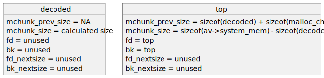

# Table of Contents

- [Table of Contents](#table-of-contents)
- [Create The Fuzz Target](#create-the-fuzz-target)
  - [Navigate to This Repo](#navigate-to-this-repo)
  - [Create The Crate](#create-the-crate)
  - [Change The Crate Lib Type](#change-the-crate-lib-type)
  - [Choosing Good Fuzz Targets](#choosing-good-fuzz-targets)
  - [Creating our Fuzz Target](#creating-our-fuzz-target)
  - [Ownership, References, Slices, and Borrowing](#ownership-references-slices-and-borrowing)
    - [Ownership and Moves](#ownership-and-moves)
    - [Borrowing Mutably and Immutably](#borrowing-mutably-and-immutably)
    - [Slices](#slices)
    - [More Resources](#more-resources)
  - [Implement the Fuzz Target](#implement-the-fuzz-target)
    - [Allocate Some Memory](#allocate-some-memory)
    - [Decode Encoded Input](#decode-encoded-input)
    - [`if let` Bindings](#if-let-bindings)
    - [Ranges](#ranges)
  - [Test the Fuzz Target](#test-the-fuzz-target)
  - [Analyzing the Bug](#analyzing-the-bug)
  - [Summary](#summary)
- [Create The Fuzzer](#create-the-fuzzer)
  - [Create The Fuzzer Crate](#create-the-fuzzer-crate)
  - [Add the LibAFL Crate](#add-the-libafl-crate)
  - [Add the Target Crate as a Dependency](#add-the-target-crate-as-a-dependency)
  - [Create a Build Script](#create-a-build-script)
    - [Coverage Sanitizer](#coverage-sanitizer)
    - [The Build Script](#the-build-script)
  - [Import LibAFL](#import-libafl)
  - [Add a Harness](#add-a-harness)


Now that we know the very basics of the Rust ecosystem, we'll dive right in and build
a fuzzer. Instead of fuzzing a very complex library or binary target right off the bat,
we'll start as small as we can and fuzz a Rust function.

# Create The Fuzz Target

## Navigate to This Repo

We'll create a fuzzer crate in this repository. If you're working through these
exercises in the Dev Container, this repository will be in
`/workspaces/documentation.security.fuzzing.libafl`. If you're working through them on
your host machine, you'll want to `cd` to wherever you cloned this repo on
[Linux](./LinuxHostNoDocker.md#clone-this-repository) or
[Windows](./WindowsHostNoDocker.md#clone-this-repository).

In any case, if you run:

```sh
$ pwd
```

You should be in `documentation.security.fuzzing.libafl`.


## Create The Crate

Create the crate and enter the directory for our first fuzzer with:

```sh
$ cargo new --lib first-target
$ cd first-target
```

You should have a template Library crate as we saw in [the Rust
Basics](./RustBasics.md#creating-a-binary-crate). To make sure everything is working
correctly, we'll run the tests `cargo` gives us 

```sh
$ cargo test
    Finished test [unoptimized + debuginfo] target(s) in 0.13s
     Running unittests src/lib.rs (target/debug/deps/first_target-d654f36012dfaf5d)

running 1 test
test tests::it_works ... ok

test result: ok. 1 passed; 0 failed; 0 ignored; 0 measured; 0 filtered out; finished in 0.00s

   Doc-tests first-target

running 0 tests

test result: ok. 0 passed; 0 failed; 0 ignored; 0 measured; 0 filtered out; finished in 0.00s
```

If you see that, we're ready to go!

## Change The Crate Lib Type

Before we move on, we need to change the crate type of our fuzz target's crate. Rust's
build system supports many crate types, which you can read more about
[here](https://doc.rust-lang.org/cargo/reference/cargo-targets.html#the-crate-type-field)
. Add these two lines to your `Cargo.toml` file:

```toml
[lib]
crate-type = ["staticlib"]
```

For most normal rust libraries or crates, this is not necessary. However because we will
be instrumenting this library for coverage feedback, we will need to build it separately
and link it into our fuzzer. We'll discuss this further in the fuzzer section.

After changing the crate type, run `cargo build` and `cargo test` again to be sure
everything is still working as expected.

## Choosing Good Fuzz Targets

The first thing we need to do when we're building a fuzzer is to identify what we want
to fuzz. What makes a good fuzz target is complicated, and there are many factors to
consider. In general, though, here are a few guidelines to keep an eye out for:

1. Code that consumes untrusted data: any code that reads data from the outside world,
   especially if the data comes from an untrusted source (i.e. comes from a user of your
   code) is a great place to use fuzzing. Fuzzing can help find security issues with how
   your code processes this data, as well as functionality and logic issues, especially
   if your project includes assertions. Code patterns that commonly fit this criteria
   include:
   - Parsers, like those for web forms or API requests in JSON or similar formats
   - OS or Library API functionality, for example when adding a system call to Linux or
   exporting any function from a library
   - Command line tools that take input
   - Update utilities that download update files from the internet
2. Code that is security critical or runs with elevated privilege: if your code runs as
   root or below (or an equivalent), it should be fuzzed. Even a single off-by-one error
   in a `memcpy` call is a critical security vulnerability in this scenario, as it
   gives way to privilege escalation. If your code is in this category, *all* of it
   should be fuzzed, not just external interfaces. We'll discuss later on some methods
   to speed up harnessing in this type of scenario.

Some additional resources for identifying good fuzz targets:

- [Google Fuzzing Guide](https://github.com/google/fuzzing/blob/master/docs/good-fuzz-target.md)
- [Intel Fuzzing Basics](https://github.com/intel-innersource/documentation.practices.security.fuzzing/blob/master/docs/FuzzingBasics.md)

## Creating our Fuzz Target

For our fuzz target, we'll assume we're writing some sort of internet accessible service
and that the function we create takes some untrusted data. That means it would falls
into category 1 above. We will create our fuzz target in Rust, and we are going to put a
bug in it intentionally for the sake of demonstration.

In your `lib.rs` file, we'll first delete the all the contents `cargo` gave us, and 
create a new function. Our fuzz target will be a decoder for a simple encoding format.

Add this (functionally incomplete, but we'll fill in the body later) definition for our
`decode` function:

```rust
pub fn decode(mut encoded_input: &[u8]) -> Vec<u8> {
    Vec::new()
}
```

This is a `pub` function (that is, it is exported) that takes a slice of encoded bytes
and returns a result (either a value or an error) where the value is a *vector* of
decoded bytes. Before we actually implement it, we need to learn a few concepts to
understand its parameter and return type.

## Ownership, References, Slices, and Borrowing

This function takes a *slice* of unsigned 8-bit bytes. A slice is a *reference* to a
sequence of values of the same *type* (in this case `u8`) of some length. To understand
what a slice is, we need to understand the basics of *references*, *ownership*, and
*borrowing*.

### Ownership and Moves

In Rust, all values have an *owner*. To check out ownership in action, we can create a
`String`  variable using a *let* binding (the keyword for a statement to create a
variable in the current scope). Notice that we call `.to_string()` to convert the string
literal (a `&str`) into a `String`, although we'll avoid discussing that until a bit
later on.

```rust
fn main() {
    let _x: String = "Hello, World!".to_string();
}
```

<center>
<a href="https://play.rust-lang.org/?version=stable&mode=debug&edition=2021&code=fn+main%28%29+%7B%0A++++let+_x%3A+String+%3D+%22Hello%2C+World%21%22.to_string%28%29%3B%0A%7D">Playground</a>
</center>
<br>

We then *own* the value `_x`. In Rust, there can only be *one* owner of a variable at a
time, so if we call a function that takes a `String` as a parameter and prints it out.
Notice that `println!` is a variadic macro, and formats instances of `{}` in its first
argument with its remaining arguments, similar to `printf` in C, although using curly
braces instead of `%` symbols.

```rust
fn foo(bar: String) {
    println!("Got {}", bar);
}

fn main() {
    let x: String = "Hello, World!".to_string();
    foo(x);
}
```

<center>
<a href="https://play.rust-lang.org/?version=stable&mode=debug&edition=2021&code=fn+foo%28bar%3A+String%29+%7B%0A++++println%21%28%22Got+%7B%7D%22%2C+bar%29%3B%0A%7D%0A%0Afn+main%28%29+%7B%0A++++let+x%3A+String+%3D+%22Hello%2C+World%21%22.to_string%28%29%3B%0A++++foo%28x%29%3B%0A%7D">Playground</a>
</center>
<br>

We will *move*, or transfer ownership, of `x` to `foo` when we pass `x` to it as a
parameter. If we then want to use the value `x` later in the `main` function, for
example to print it out:

```rust
fn foo(bar: String) {
    println!("Got {}", bar);
}

fn main() {
    let x: String = "Hello, World!".to_string();
    foo(x);
    println!("X is {}", x);
}
```

<center>
<a href="https://play.rust-lang.org/?version=stable&mode=debug&edition=2021&code=fn+foo%28bar%3A+String%29+%7B%0A++++println%21%28%22Got+%7B%7D%22%2C+bar%29%3B%0A%7D%0A%0Afn+main%28%29+%7B%0A++++let+x%3A+String+%3D+%22Hello%2C+World%21%22.to_string%28%29%3B%0A++++foo%28x%29%3B%0A++++println%21%28%22X+is+%7B%7D%22%2C+x%29%3B%0A%7D">Playground</a>
</center>
<br>

You'll notice if you build or run this code in the Playground, we get a compile error:

```sh
   Compiling playground v0.0.1 (/playground)
error[E0382]: borrow of moved value: `x`
 --> src/main.rs:8:25
  |
6 |     let x: String = "Hello, World!".to_string();
  |         - move occurs because `x` has type `String`, which does not implement the `Copy` trait
7 |     foo(x);
  |         - value moved here
8 |     println!("X is {}", x);
  |                         ^ value borrowed here after move
  |
note: consider changing this parameter type in function `foo` to borrow instead if owning the value isn't necessary
 --> src/main.rs:1:13
  |
1 | fn foo(bar: String) {
  |    ---      ^^^^^^ this parameter takes ownership of the value
  |    |
  |    in this function
  = note: this error originates in the macro `$crate::format_args_nl` which comes from the expansion of the macro `println` (in Nightly builds, run with -Z macro-backtrace for more info)
help: consider cloning the value if the performance cost is acceptable
  |
7 |     foo(x.clone());
  |          ++++++++

For more information about this error, try `rustc --explain E0382`.
error: could not compile `playground` due to previous error

```

The error breaks down exactly what is happening here. `main` owned `x` when it was
declared, but it transferred ownership of `x` to `foo` when it passed `x` to `foo` as a
parameter. This means that when we try to use `x` in the `println!` statement we just
added to `main`, `main` actually no longer owns `x`, so it is an error to try and use
it!

This relationship is the core of how Rust ensures its safety guarantees, but may be
surprising to experienced C/C++ programmers because those languages have no enforced
concept of ownership of variables at all. There are a few ways to resolve this. The
first is to do what the compiler suggests, and `clone()` the string. This creates a
duplicate of the string in memory, and passes that duplicate to `foo`. This way, `main`
retains ownership of `x`, and `foo` gets its own duplicate as a parameter. These are
two *different* values, of course, but we are not modifying them so this is semantically
equivalent.

```rust
fn foo(bar: String) {
    println!("Got {}", bar);
}

fn main() {
    let x: String = "Hello, World!".to_string();
    foo(x.clone());
    println!("X is {}", x);
}
```

<center>
<a href="https://play.rust-lang.org/?version=stable&mode=debug&edition=2021&code=fn+foo%28bar%3A+String%29+%7B%0A++++println%21%28%22Got+%7B%7D%22%2C+bar%29%3B%0A%7D%0A%0Afn+main%28%29+%7B%0A++++let+x%3A+String+%3D+%22Hello%2C+World%21%22.to_string%28%29%3B%0A++++foo%28x.clone%28%29%29%3B%0A++++println%21%28%22X+is+%7B%7D%22%2C+x%29%3B%0A%7D">Playground</a>
</center>
<br>

If we run this, it'll succeed! However, we have made two tradeoffs. First, `clone()`
isn't free, either in terms of memory space or compute cycles. Second, if we added code
that modifies `x` in `foo`, `main` wouldn't print that modified value, it would print
the initial value. In this example, note that we have added the `mut` keyword to the
`bar` parameter in `foo`. This means this variable is *mutable*, so we can change it. If
we didn't add `mut`, it would be a compile error to modify the value of `bar` in this
function.

```rust
fn foo(mut bar: String) {
    bar += " I'm here!";
    println!("Got {}", bar);
}

fn main() {
    let x: String = "Hello, World!".to_string();
    foo(x.clone());
    println!("X is {}", x);
}
```

<center>
<a href="https://play.rust-lang.org/?version=stable&mode=debug&edition=2021&code=fn+foo%28mut+bar%3A+String%29+%7B%0A++++bar+%2B%3D+%22+I%27m+here%21%22%3B%0A++++println%21%28%22Got+%7B%7D%22%2C+bar%29%3B%0A%7D%0A%0Afn+main%28%29+%7B%0A++++let+x%3A+String+%3D+%22Hello%2C+World%21%22.to_string%28%29%3B%0A++++foo%28x.clone%28%29%29%3B%0A++++println%21%28%22X+is+%7B%7D%22%2C+x%29%3B%0A%7D">Playground</a>
</center>
<br>

If we run this program in the Playground now, we'll see:

```
Got Hello, World! I'm here!
X is Hello, World!
```

This is, semantically, what we expect. `foo` modified its duplicate of `x` and printed
out the duplicate, while `main` printed out the original value. But what if we wanted
`foo` to modify the original value, instead? In C/C++, we'd pass a *pointer* to `x` to
`foo` if we wanted to do that. Rust has a similar concept called a *reference*, and the
act of creating a reference is called *borrowing*.

### Borrowing Mutably and Immutably

A *reference* is denoted with the `&` symbol, so a `String` is the actual string instance,
while an `&String` is a *reference* to the string instance. Like variables, *references*
can be mutable or immutable, and mutable references are written `&mut`. These are also
sometimes called *mutable borrows*, because *borrow* and *reference* are used somewhat
interchangeably in Rust literature.

We'll change our `foo` function to take a *mutable reference* to a `String` instead of
taking ownership of its parameter. This has another side effect of making the `clone()`
call unnecessary. Because we are passing a *reference* as a parameter, we need to
*dereference* the variable in order to modify it. We also need to change how we pass in
the parameter to `foo`. Instead of just passing `x`, which is the variable `x`, we want
to pass a *mutable reference* to `x`, so we write `&mut x`. `println!` doesn't need us to
dereference `x` for it, because a `&String`, `&mut String`, and `String` can all be
`Display`-ed with the same code.

```rust
fn foo(bar: &mut String) {
    *bar += " I'm here!";
    println!("Got {}", bar);
}

fn main() {
    let mut x: String = "Hello, World!".to_string();
    foo(&mut x);
    println!("X is {}", x);
}
```

<center>
<a href="https://play.rust-lang.org/?version=stable&mode=debug&edition=2021&code=fn+foo%28bar%3A+%26mut+String%29+%7B%0A++++*bar+%2B%3D+%22+I%27m+here%21%22%3B%0A++++println%21%28%22Got+%7B%7D%22%2C+bar%29%3B%0A%7D%0A%0Afn+main%28%29+%7B%0A++++let+mut+x%3A+String+%3D+%22Hello%2C+World%21%22.to_string%28%29%3B%0A++++foo%28%26mut+x%29%3B%0A++++println%21%28%22X+is+%7B%7D%22%2C+x%29%3B%0A%7D">Playground</a>
</center>
<br>

We can run this now in the Playground and see that we print out the modified message
*both* times:

```
Got Hello, World! I'm here!
X is Hello, World! I'm here!
```

Hopefully you have a rough understanding of what it means to *own*, *reference*, *borrow*,
and *dereference* in Rust. Remember up [above](#ownership-and-moves) when we brushed
past using `.to_string()` to convert a `&str` to a `String`? The `.to_string()` method
is implemented for `str` references and returns a `String`!

### Slices

We just need one more concept before we're ready to move on with our fuzz target:
slices!

A slice is just a *reference* to a sequence of items with the same type. They can be
created literally, as with this creation of a slice referencing the sequence of two
strings:

```rust
fn main() {
    let _x: &[String] = &[
        "Hello, World!".to_string(),
        "I'm here!".to_string()
    ];
}
```

<center>
<a href="https://play.rust-lang.org/?version=stable&mode=debug&edition=2021&code=fn+main%28%29+%7B%0A++++let+_x%3A+%26%5BString%5D+%3D+%26%5B%0A++++++++%22Hello%2C+World%21%22.to_string%28%29%2C%0A++++++++%22I%27m+here%21%22.to_string%28%29%0A++++%5D%3B%0A%7D">Playground</a>
</center>
<br>

They can also be created by referencing another data structure. For example a slice of a
`Vec` (equivalent to a C++ `std::vector`) is a reference to a sequence of its entries.
We can also take a slice of a `String`'s characters as a sequence of bytes using
`.as_bytes()`. Slices are very flexible, and many methods of various types yield slices
of different underlying element types (such as `as_bytes()`).

```rust
fn main() {
    let v: Vec<String> = vec![
        "Hello, World!".to_string(),
        "I'm here!".to_string()
    ];
    let _x: &[String] = &v;
    let u: String = "Hello, World!".to_string();
    let _y: &[u8] = u.as_bytes();
}
```

<center>
<a href="https://play.rust-lang.org/?version=stable&mode=debug&edition=2021&code=fn+main%28%29+%7B%0A++++let+v%3A+Vec%3CString%3E+%3D+vec%21%5B%0A++++++++%22Hello%2C+World%21%22.to_string%28%29%2C%0A++++++++%22I%27m+here%21%22.to_string%28%29%0A++++%5D%3B%0A++++let+_x%3A+%26%5BString%5D+%3D+%26v%3B%0A++++let+u%3A+String+%3D+%22Hello%2C+World%21%22.to_string%28%29%3B%0A++++let+_y%3A+%26%5Bu8%5D+%3D+u.as_bytes%28%29%3B%0A%7D">Playground</a>
</center>
<br>

### More Resources

These Rust language topics are complex and nuanced, so you should be sure to read
[Understanding
Ownership](https://doc.rust-lang.org/book/ch04-00-understanding-ownership.html) from the
Rust documentation to understand them more deeply.

## Implement the Fuzz Target

Now that we know what a *slice* is, we can implement our function. Remember our
function skeleton from our `lib.rs`:

```rust
pub fn decode(mut encoded_input: &[u8]) -> Vec<u8> {
    Vec::new()
}
```

We'll implement a simple decoder for URL-encoded text. URL-encoding looks something like
`This%20string%20is%20URL%20encoded`. We want to have a bug in this program that causes
it to crash, so we will use a bit of *unsafe* Rust. You can read all about unsafe Rust
[here](https://doc.rust-lang.org/book/ch19-01-unsafe-rust.html) but basically the
`unsafe` keyword lets you:

- Dereference a raw pointer
- Call an unsafe function or method
- Access or modify a mutable static variable
- Implement an unsafe trait
- Access fields of unions

We'll use it to program like we're writing C/C++. You don't need to do this (there's a
perfectly good [safe
implementation](https://docs.rs/urlencoding/latest/src/urlencoding/dec.rs.html) of URL
decoding), we're just doing it for an example of a good fuzz target.

### Allocate Some Memory

We need to allocate some memory to store our decoded data. Here's where our bug will
live. We'll naively assume that because a `%` followed by two characters decodes to the
byte with the hex value of those two characters, that we can count up the `%` signs,
multiply it by 2, then subtract that count from the length of the input bytes to get the
decoded size. This is a bug because `%%` is a special case: it simply escapes the `%` and
decodes to one `%`. Thus, `aa%` would calculate a buffer length of `1`, but we actually
need `2` bytes of space to store the decoded string.

```rust
use std::{
    alloc::{alloc, Layout},
    str::from_utf8_unchecked,
};

pub fn decode(encoded_input: &[u8]) -> Vec<u8> {
    let decoded_len =
        encoded_input.len() - (encoded_input.iter().filter(|c| **c == b'%').count() * 2);
      
    if decoded_len <= 0 {
      return Vec::new();
    }

    let decoded_layout = Layout::array::<u8>(decoded_len).expect("Could not create layout");

    let decoded = unsafe { alloc(decoded_layout) };
    let mut decoded_ptr = decoded;

    Vec::new()
}
```

There are a few things going on here. We'll go step by step. First, we filter our
encoded input for '%' characters and count them, then subtract double that count from
the length of the encoded input to find the length of the decoded data. Remember, this
is an *intentional bug* because of various nuances in the decoding process.

Next, we create a `Layout` (a description of an element size and length of an array of
`u8`s) of the length we just calculated. Notice the syntax of the `Layout` constructor
contains a *turbofish* (`::<>`), which is the syntax Rust uses for generic parameters.
Rust's generics are somewhat similar to C++, where if we wanted to construct a `Layout`
of an array of `u32`s instead, we would write `Layout::array::<u8>(decoded_len)`. We'll
dive further into generic parameters later in these exercises, and you can read about
them [here](https://doc.rust-lang.org/reference/items/generics.html).

The `.expect()` function makes sure that a `Result<T, E>` is `Ok(T)` or that an
`Option<T>` is `Some(T)`. If not, it will *panic* (or abort) with the message in the
call to `.expect()`.

Finally, we have an `unsafe` block with a call to `alloc()`. This performs the
allocation for the decoded data. This is unsafe, because an `alloc` call with a
zero-sized layout is undefined behavior. Thus, this allocation in our code is actually
*safe* because we already checked to make sure the size is positive and non-zero. This
is a good reminder that `unsafe` in Rust does not mean the code is actually unsafe to
run, it only means that it is *allowed* to violate Rust's safety guarantees. We save the
pointer to the beginning of our decoded data (`decoded`) and duplicate the pointer to
(`decoded_ptr`) that we will use to write into our allocated memory.

### Decode Encoded Input

Now, we'll do our actual decoding and write the decoded data into our pointer.

```rust
use std::{
    alloc::{alloc, Layout},
    str::from_utf8_unchecked,
};
pub fn decode(mut encoded_input: &[u8]) -> Vec<u8> {
    /* ... Code from above ... */
    loop {
        let mut parts = encoded_input.splitn(2, |&c| c == b'%');
        let not_escaped_part = parts.next().expect("Did not get any unescaped data");
        let rest = parts.next();
```

The first line here, `loop {` is a *loop statement*, which will run the block inside the
loop forever, until either a `break` or `return` happens.

Each time we run our loop, we split our encoded input on the first '%' character,
splitting it into at most 2 parts (hence `splitn`). The first part is any data at the
beginning of the encoded input before the first '%', the second part is the rest of the
encoded input after the first '%', if there is any. `parts` is an *iterator* over
sub-slices of type `&[u8]`.

`Iterator`s over an `Item` type (in this case, `&[u8]`) are types that have a `next()`
function to return the next `Item` if there is one, and `None` if there are no more
items (using an `Option` type, with the same semantics as Python's `Optional[]` and
C++'s `std::option`). Rust's iterators are extremely similar to Python's, and somewhat
similar to C++'s in theory (they both allow you to iterate over entries of some
collection), although not in implementation.


```rust
        if rest.is_none() && decoded == decoded_ptr {
            return encoded_input.to_vec();
        } else {
```

Next, we check to see if we have anything in `rest`. If not, the `%` was at the end of
the input, or there was no '%'. If this is the case and we haven't written any decoded
data to our output, we can return the encoded input as the result, converting the slice
to a `Vec` (which performs an allocation).

```rust
            for not_escaped_byte in not_escaped_part {
                unsafe { *decoded_ptr = *not_escaped_byte };
                unsafe { decoded_ptr = decoded_ptr.add(1) };
            }
```

If we didn't return early, we always write our "not escaped" data to our output. This
operation is exactly equivalent to `*ptr = b; ptr++;` in C, we simply need to wrap this
operation in `unsafe`, because we are dereferencing a raw pointer. `++` and `+=` are
also not defined on raw pointers, but we can use the `.add()` method, which is

```rust
            if let Some(rest) = rest {
                if let Some(&[first, second]) = rest.get(0..2) {
                    if let Ok(first_val) =
                        u8::from_str_radix(unsafe { from_utf8_unchecked(&[first]) }, 16)
                    {
                        if let Ok(second_val) =
                            u8::from_str_radix(unsafe { from_utf8_unchecked(&[second]) }, 16)
                        {
                            unsafe { *decoded_ptr = (first_val << 4) | second_val };
                            unsafe { decoded_ptr = decoded_ptr.add(1) };
                            encoded_input = &rest[2..];
                        } else {
                            unsafe { *decoded_ptr = b'%' };
                            unsafe { decoded_ptr = decoded_ptr.add(1) };
                            unsafe { *decoded_ptr = first };
                            unsafe { decoded_ptr = decoded_ptr.add(1) };
                            encoded_input = &rest[1..];
                        }
                    } else {
                        unsafe { *decoded_ptr = b'%' };
                        unsafe { decoded_ptr = decoded_ptr.add(1) };
                        encoded_input = rest;
                    }
                } else {
                    unsafe { *decoded_ptr = b'%' };
                    unsafe { decoded_ptr = decoded_ptr.add(1) };

                    for rest_byte in rest {
                        unsafe { *decoded_ptr = *rest_byte };
                        unsafe { decoded_ptr = decoded_ptr.add(1) };
                    }

                    break;
                }
            } else {
                break;
            }
        }
    }

    unsafe { Vec::from_raw_parts(decoded, decoded_len, decoded_len) }
}
```
 
The rest of the code is somewhat difficult to break up coherently. There are only a
few important new concepts, however.

### `if let` Bindings

The first concept is `if let` bindings, which you can read about
[here](https://doc.rust-lang.org/book/ch06-03-if-let.html). This control flow construct
allows us to check if the value of an expression *matches* some pattern, and bind it to
a new variable if so. We can have an `else` branch on this `if let` statement as well.

We can check out a brief demo of this pattern on both `Option`s and `Result`s. In the
code below, we have two `Option`s and two `Result`s. The first option is `None`, while
the second is `Some(T)` (where `T` is `String` in this case). We can pattern match both
of these variables using `if let` to bind them to a new variable if they match the
pattern (`Some(_)`) that we are checking for. Notice in the first check, we bind `x` to
a new variable `x`, and in the second we bind `x` to a new variable `e`. We can do the
same for `Result`.

```rust
fn main() {
  let x: Option<String> = None;
  let y: Option<String> = Some("Hello, World!".to_string());

  if let Some(x) = x {
      println!("x is some: {}!", x);
  } else {
      println!("x is none");
  }

  if let Some(e) = y {
      println!("y is some: {}!", e);
  } else {
      println!("y is none");
  }

  let w: Result<String, String> = Err("There was something wrong...".into());
  let z: Result<String, String> = Ok("Hello, World!".to_string());

  if let Ok(z) = z {
      println!("z was ok: {}!", z);
  } else {
      println!("z was not ok");
  }

  if let Err(e) = w {
      println!("w was err: {}!", e);
  } else {
      println!("w was ok");
  }
}
```

<center>
<a href="https://play.rust-lang.org/?version=stable&mode=debug&edition=2021&code=fn+main%28%29+%7B%0A++++let+x%3A+Option%3CString%3E+%3D+None%3B%0A++++let+y%3A+Option%3CString%3E+%3D+Some%28%22Hello%2C+World%21%22.to_string%28%29%29%3B%0A++++%0A++++if+let+Some%28x%29+%3D+x+%7B%0A++++++++println%21%28%22x+is+some%3A+%7B%7D%21%22%2C+x%29%3B%0A++++%7D+else+%7B%0A++++++++println%21%28%22x+is+none%22%29%3B%0A++++%7D%0A++++%0A++++if+let+Some%28y%29+%3D+y+%7B%0A++++++++println%21%28%22y+is+some%3A+%7B%7D%21%22%2C+y%29%3B%0A++++%7D+else+%7B%0A++++++++println%21%28%22y+is+none%22%29%3B%0A++++%7D%0A%7D">Playground</a>
</center>
<br>


Back to our code. In the first check, we check if `rest` is `Some` (`Option<T>` values
in rust are either `Some(T)` or `None`). If so, we bind it to a new variable (also
called `rest`, there is no need to choose a new name, this newly bound variable has a
smaller scope). We use the `if let` pattern again, to check if we have at least 2
characters at the beginning of `rest`.

### Ranges

The `.get()` call uses a *range* (`0..2`) from `0` to `2`, inclusive on the low and
exclusive on the high end of the range. Ranges are first-class objects in Rust and work
in a similar way as in Python (although with `..` instead of `:`). The [String
Slices](https://doc.rust-lang.org/book/ch04-03-slices.html?highlight=range#string-slices)
section goes into depth on slice syntax. 

The rest of the code parses the escape hex codes and takes an appropriate action based
on the values, writing to the output data and incrementing the pointer we are writing
through as needed. Finally, we construct a vector from the pointer, decoded size, and a
*capacity* (which we just provide the size as) and return it. Note that unlike earlier,
the `unsafe` code we are running here truly is *unsafe*. Because we don't calculate our
buffer size correctly, these writes can go out of bounds of the allocated memory,
causing heap corruption.

You can find the full code for the implemented function in
[lib.rs](../first-target-solution/src/main.rs).

## Test the Fuzz Target

Like any good developers, we will create a few unit tests for our code before we worry
about fuzzing or any additional security testing.

We can add our tests directly in `lib.rs`:

```rust
#[cfg(test)]
mod tests {
    use super::*;

    #[test]
    fn it_decodes_successfully_emoji() {
        let expected = String::from("👾 Exterminate!").as_bytes().to_vec();
        let encoded = "%F0%9F%91%BE%20Exterminate%21".as_bytes();
        assert_eq!(expected, decode(encoded));
    }

    #[test]
    fn it_decodes_misc() {
        assert_eq!("".as_bytes().to_vec(), decode("".as_bytes()));
        assert_eq!(
            "pureascii".as_bytes().to_vec(),
            decode("pureascii".as_bytes())
        );
        assert_eq!("\0".as_bytes().to_vec(), decode("\0".as_bytes()));
        assert_eq!(
            "this that".as_bytes().to_vec(),
            decode("this%20that".as_bytes())
        );
    }

    // #[test]
    // fn it_crashes() {
    //     println!("{:?}", decode("aaaaaaaaaaaaaaaa%%%%%%%%%%%%".as_bytes()));
    // }
}
```

Note that we have a third test here commented out. Run `cargo test` in your crate.

```sh
$ cargo test
   Compiling first-targetv0.1.0 (/workspaces/documentation.security.fuzzing.libafl/first-target)
    Finished test [unoptimized + debuginfo] target(s) in 0.33s
     Running unittests src/lib.rs (target/debug/deps/first_target-49e422aa7de12c55)

running 2 tests
test tests::it_decodes_misc ... ok
test tests::it_decodes_successfully_emoji ... ok

test result: ok. 2 passed; 0 failed; 0 ignored; 0 measured; 0 filtered out; finished in 0.00s
```

## Analyzing the Bug

Our unit tests pass! Now lets check out what happens if we uncomment the third function.

```sh
$ cargo test
   Compiling first-targetv0.1.0 (/workspaces/documentation.security.fuzzing.libafl/first-target)
    Finished test [unoptimized + debuginfo] target(s) in 0.27s
     Running unittests src/lib.rs (target/debug/deps/first_target-49e422aa7de12c55)

running 3 tests
malloc(): corrupted top size
error: test failed, to rerun pass `--lib`

Caused by:
  process didn't exit successfully: `/workspaces/documentation.security.fuzzing.libafl/first-target/target/debug/deps/first_target-49e422aa7de12c55` (signal: 6, SIGABRT: process abort signal)
```


The program crashes with an error in `libc` `malloc`. We've corrupted the top chunk
size, so malloc crashes. We can investigate exactly where this error occurs in the
malloc source code by searching the error message, and we find out it happens
[here](https://github.com/bminor/glibc/blob/7c32cb7dd88cf100b0b412163896e30aa2ee671a/malloc/malloc.c#L4359).
What's happening is that we only have one allocation in our program, so the heap looks
like the image below. Recall the heap grows from low to high addresses (left to right
below).

<center>

</center>
<br>

The "top chunk" is a special chunk that contains all the memory that hasn't been
allocated yet, and is also known as the "wilderness". When we write out of bounds of the
memory we allocated for `decoded`, we overwrite the `mchunk_size` field of the metadata
of the top chunk. This can lead to an attack known as [House of
Force](https://github.com/shellphish/how2heap/blob/master/glibc_2.27/house_of_force.c).
This specific attack isn't important for our fuzzing, but it's a good case study of how
dangerous an error as simple as naive size calculation can be. Not to mention, we end up
incorrectly handling trailing `%` characters!

If you don't see an error on your system, that's ok. It's somewhat dependent on what
`libc` version is in use (if you are on Linux), and what size of overflow we end up
performing. Even if this function doesn't crash on your system, our fuzzer will be able
to crash it with some input it will come up with. Go ahead and re-comment that
test function.

## Summary

In this section, we learned about:

- Choosing a good fuzz target
- Rust `let` bindings
- Rust ownership, references, slices, mutable and immutable borrowing
- The basics of `unsafe` Rust including allocation and using raw pointers
- Rust loops, iterators, raw pointer arithmetic, `if let` bindings, and ranges
- Rust tests
- Triaging a simple heap overflow by searching on GitHub
<!--TODO -->
You can view the checkpoint at this point in the exercise [here]().

# Create The Fuzzer

Now that we have an appropriate target and we know there's a bug in it, it's time to
write our fuzzer!

## Create The Fuzzer Crate

Navigate back to the root of this repository (you should be in
`documentation.security.fuzzing.libafl`). Then, create a fuzzer crate and navigate to
it, then run it to make sure everything is set up correctly:

```sh
$ cargo new --bin first-fuzzer
$ cd first-fuzzer
$ cargo run --bin first-fuzzer
    Finished dev [unoptimized + debuginfo] target(s) in 0.00s
     Running `target/debug/first-fuzzer`
Hello, world!
```

## Add the LibAFL Crate

To add LibAFL as a dependency to our crate, we can just run:

```sh
$ cargo add libafl@0.10.0
```

This may take a minute because it will update your `crates.io` index if this is the
first time you have added a `crates.io` dependency.

Check that the depedency is added by viewing the `Cargo.toml` for the crate. It should
have `libafl = "0.10.0"` under the `[dependencies]` section.

Let's check to make sure we can build and run with the dependency added.

```sh
$ cargo build
$ cargo run --bin first-fuzzer
```

You should have the same result as above, but you'll see `libafl` and its
sub-dependencies compile.

## Add the Target Crate as a Dependency

In order to link in our fuzz target and call it from our fuzzer, we need to add it as a
dependency. Run:


```sh
$ cargo add --path ../first-target
```

You should see the following line appear in your `Cargo.toml` file under
`[dependencies]`:

```toml
first-target = { version = "0.1.0", path = "../first-target" }
```

## Create a Build Script

`cargo` supports *build scripts* (you can read the documentation on them
[here](https://doc.rust-lang.org/cargo/reference/build-scripts.html)). By creating a
`build.rs` file in our crate directory, `cargo` will run it before compiling the crate.

`build.rs` scripts provide a few key features, notably the ability to modify or add
linking information during crate compilation. We need our build script to do two things:

1. Compile `first-target` with the coverage sanitizer enabled
2. Tell `cargo` (and through it, `rustc`) to link with the coverage sanitized library
   when compiling the fuzzer binary

### Coverage Sanitizer

Before we use it, we need a bit of background on what a *coverage sanitizer* actually is,
as well as what sanitizer interface we will use for this fuzzer.

LLVM and MSVC provide a feature called
[SanitizerCoverage](https://clang.llvm.org/docs/SanitizerCoverage.html). Code coverage
is a relatively simple concept, and it is explained well by the documentation. Our goal
is simply to measure *how much* of the code we care about is executed as well as *which
parts* of the code we care about are executed for each fuzzing run.

`SanitizerCoverage` is implemented at the LLVM level of compilation, and has several
optional implementations:

- PC Trace: a function is called on each control flow edge in the program.
- Guards: a function is called on each control flow edge in the program that is only
  triggered if a guard value is true. Same as PC trace with guards added.
- Counters: a per-edge counter variable is incremented on each traversal of the edge
- PC Table: Adds a table describing whether each block starting at `pc` is a function
  entry block or not

The exact arguments change over time with new LLVM releases, but [the LLVM
Doxygen](https://llvm.org/doxygen/SanitizerCoverage_8cpp.html) describes all of them.

For this fuzzer, we will use the following options for `SanitizerCoverage`:

- `-sanitizer-coverage-level=3`: Level 3 is all blocks and critical edges.
- `-sanitizer-coverage-inline-8bit-counters`: Use counters to track how many times each
  edge is hit.
- `-sanitizer-coverage-prune-blocks=0`: Don't remove coverage info from any blocks.
- `passes=sancov-module`: Tells LLVM to run the `SanitizerCoverage` module.

### The Build Script

To pass arguments to the compilation of a specific dependency, we can use the
`cargo rustc` subprogram. This lets us pass arguments to `rustc`, the Rust compiler, as
well as to [*LLVM*](https://llvm.org), which `rustc` uses for final code generation and
additional optimization. We'll use `std::process::Command`, which is similar to using
`subprocess.Popen` in Python or `system` in C, although much more flexible.

We'll walk through the `cargo rustc` arguments that we'll add in addition to the
`SanitizerCoverage` flags.

- `-p first-target-solution`: Tell `rustc` to just build the target with these arguments,
  rather than pass these arguments to *all* the code we're compiling.
- `--target-dir target/first-target/`: Tell `rustc` to build in a subdirectory of the
  default `target` directory, to avoid conflicting with the currently running build
  process' lock on the `target` directory.
- `link-dead-code`: Don't prune any unused code from the compilation result.
- `lto=no`: Don't do link-time optimization, because it might remove some code or
   instrumentation.
- `--emit=dep-info,link`: Emit linking and dependency information.

```rust
use std::process::Command;

fn main() {
    let status = Command::new("cargo")
        .arg("rustc")
        .arg("-p")
        .arg("first-target")
        .arg("--target-dir")
        .arg("target/first-target/")
        .arg("--")
        .arg("-C")
        .arg("prefer-dynamic")
        .arg("-C")
        .arg("passes=sancov-module")
        .arg("-C")
        .arg("llvm-args=-sanitizer-coverage-level=3")
        .arg("-C")
        .arg("llvm-args=-sanitizer-coverage-inline-8bit-counters")
        .arg("-C")
        .arg("llvm-args=-sanitizer-coverage-prune-blocks=0")
        .arg("-C")
        .arg("link-dead-code")
        .arg("-C")
        .arg("lto=no")
        .arg("--emit=dep-info,link")
        .status()
        .expect("Failed to spawn Cargo");

    assert!(status.success(), "Target build command failed");
```

We'll also use some specially formatted print statements in our build script to instruct
`cargo` to link with the library. Note the `env!` macro, which grabs the value of an
environment variable at compile time (and is a compile error if the variable isn't
present). The `CARGO_MANIFEST_DIR` environment variable is set automatically by `cargo`
during build script compilation and execution. You can check the full list of these
environment variables
[here](https://doc.rust-lang.org/cargo/reference/environment-variables.html). You can
also check out the full list of special print messages
[here](https://doc.rust-lang.org/cargo/reference/build-scripts.html).

```rust
    println!("cargo:rustc-link-lib=first_target");
    println!(
        "cargo:rustc-link-search={}/target/first-target/debug/",
        env!("CARGO_MANIFEST_DIR")
    );
}
```

## Import LibAFL

Before we can use LibAFL in our code, we need to import it. At the top of your `main.rs`
file, add:

```rust
use libafl::prelude::*;
```

## Add a Harness


