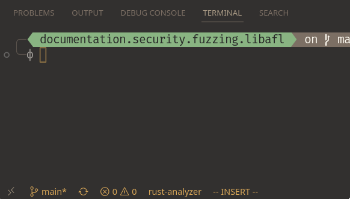

# Open Repository In Dev Container

This repository uses `devcontainer.json` to provide a Development Container you can read
an overview of Dev Containers
[here](https://code.visualstudio.com/docs/devcontainers/containers) or read about the
spec [here](https://containers.dev/implementors/json_reference/) if you wish, but they
are essentially a simple way to use a repository inside a container. In VSCode, with the
[Remote Development](https://marketplace.visualstudio.com/items?itemName=ms-vscode-remote.vscode-remote-extensionpack)
extension installed you should see this icon with two arrows in the bottom left corner
of your VSCode window:



Click that icon, and a dropdown will open at the top of your VSCode window. Select
`Reopen in Container` to open the repository in the development container. You can
test that you are in the dev container by opening a terminal (``Ctrl+Shift+` ``) and running:

```sh
$ pwd
/workspaces/documentation.security.fuzzing.libafl
$ echo "${IS_LIBAFL_TRAINING_DEVCONTAINER}"
1
```

If you do not see either of the above, you may not be in the dev container!
