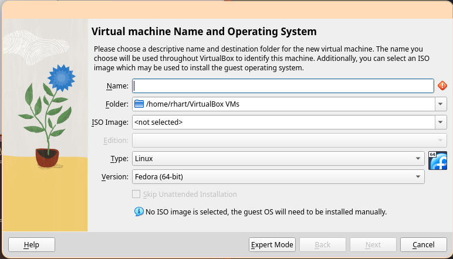
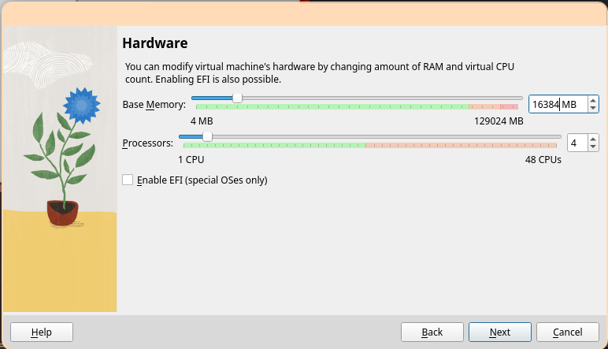
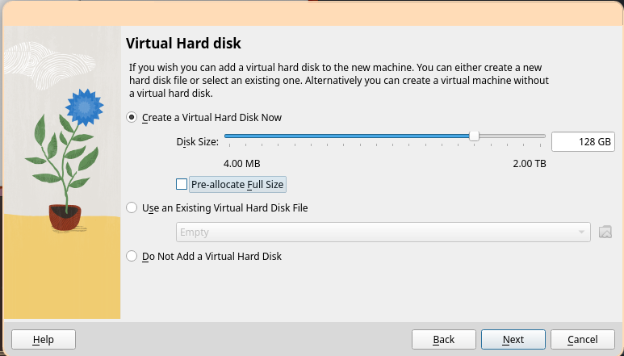
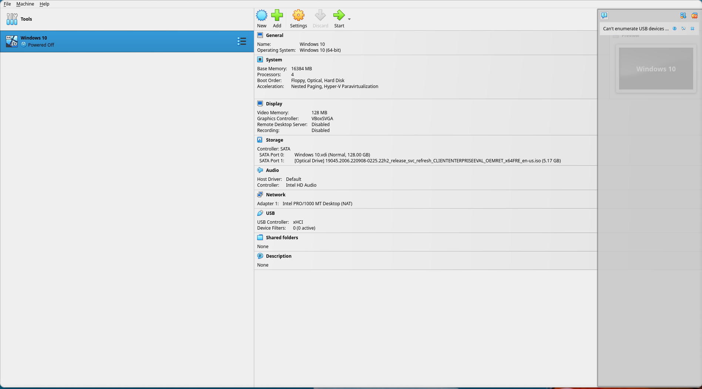

# Create a VM 

Run VirtualBox. You will be greeted with this window:

Click "New" to create a new Virtual Machine.

Enter a name, select the ISO image we [downloaded](#download-windows), and be sure to
check "Skip unattended installation". Then, click "Next".

At least 4GB of RAM and 1 CPU is recommended, but add more if you have resources
available. Then, click "Next".

At least 64GB of disk space is recommended to ensure enough space for all required
development tools, including Visual Studio and the Windows Driver Kit.

Ensure the settings look correct, then select "Finish".

Start the VM by selecting "Start" with the newly created VM selected in the left-hand
menu.
