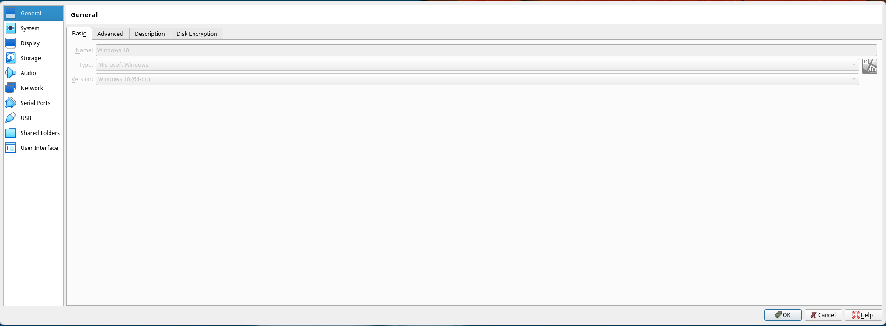
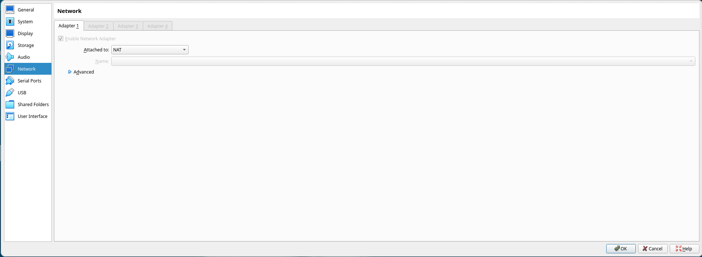
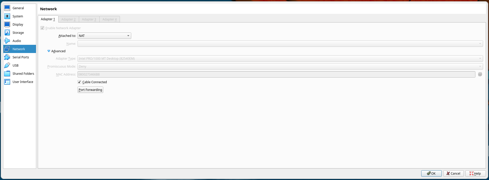

# Enable SSH Port Forwarding in VirtualBox



In the VirtualBox menu bar, select `Machine` > `Settings` to open the machine settings.



Select the "Network" tab on the left.



Select the "Advanced" drop-down menu.


Select the "Port Forwarding" button to open the port forwarding menu.


Select the top-right button "Adds port forwarding rule" to add a new rule.


Add a forwarding rule called "OpenSSH" on protocol TCP from host port 2222 to guest port 22. Leave both IP fields blank. Select "OK" in the port forwarding menu, then select "OK" on the settings menu.

Then, on your host (if your host is a Windows machine, enable the `OpenSSH.CLIENT` capability on your host as shown above), run:

```sh
ssh -p 2222 user@localhost
```

After entering the password at the prompt, you should be greeted with a command prompt:

```txt
Microsoft Windows [Version 10.0.19045.2006]
(c) Microsoft Corporation. All rights reserved.

user@DESKTOP-E04G80I C:\Users\user>
```
