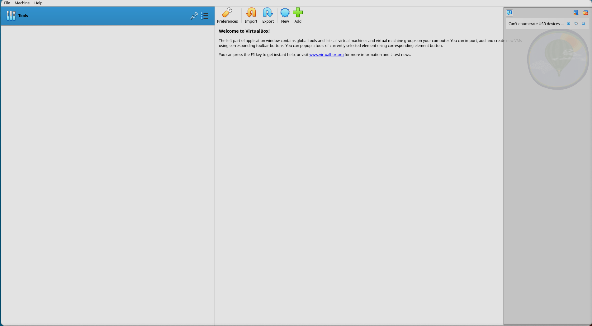
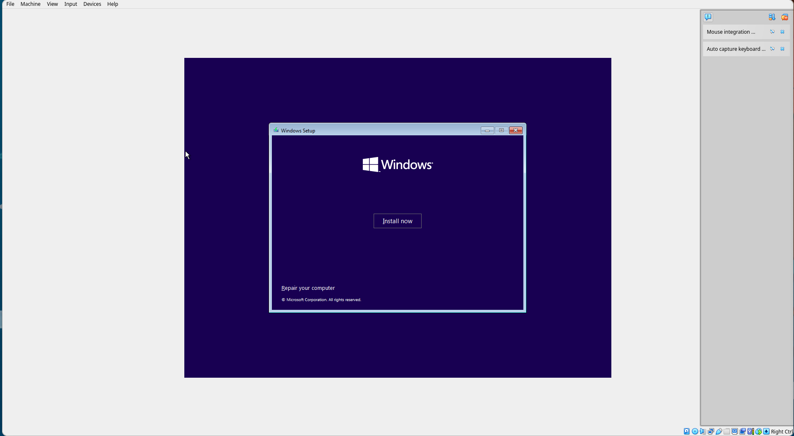
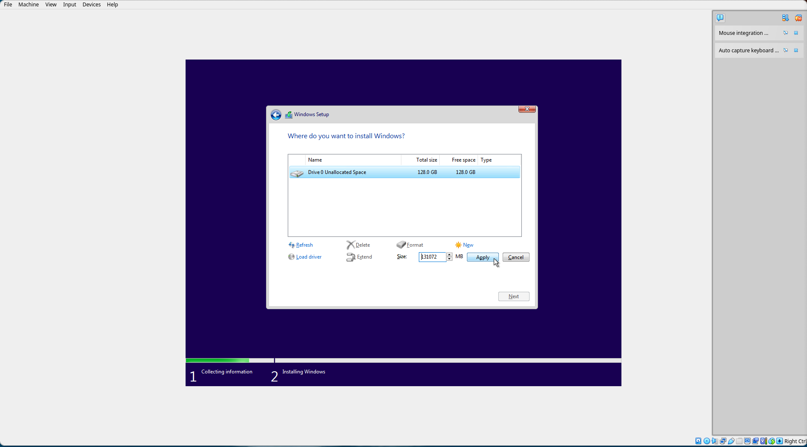
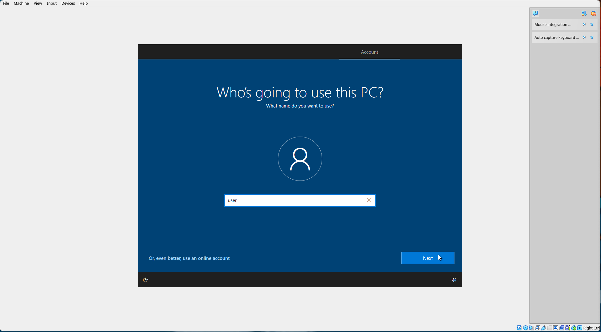
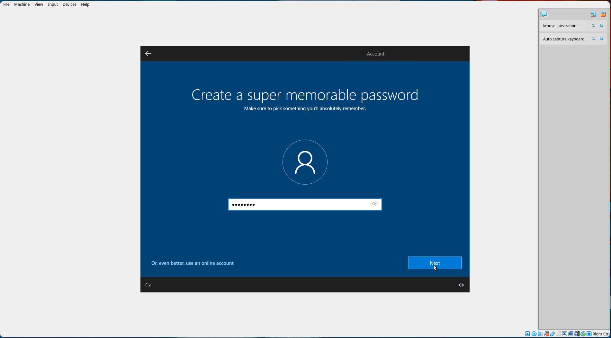
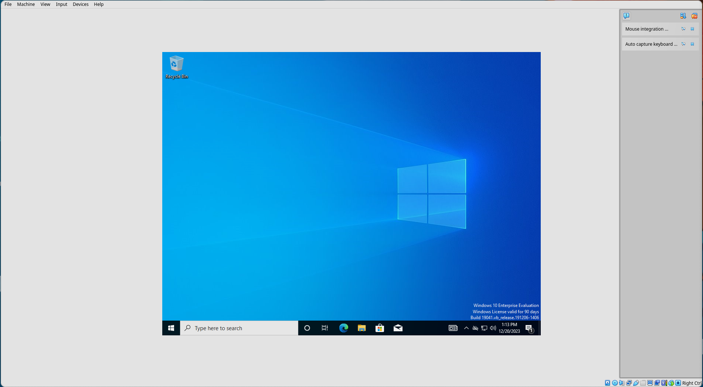
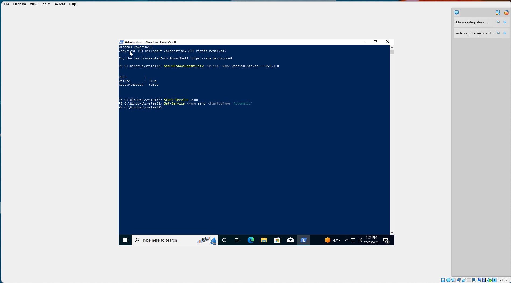

# Setting up Windows in VirtualBox

We'll set up Windows for fuzzing and development using VirtualBox. Note that because we
will be fuzzing both user and kernel-space, it is *not* recommended to follow this
tutorial on your host machine!

## Install VirtualBox

Install VirtualBox from [virtualbox.org](https://www.virtualbox.org/wiki/Downloads).
VirtualBox supports Windows, Linux, and macOS.

## Download Windows

Download an ISO for 64-bit Windows 10 from the [Microsoft Evaluation Center](https://www.microsoft.com/en-us/evalcenter/download-windows-10-enterprise).


## Create a VM 

Run VirtualBox. You will be greeted with this window:



Click "New" to create a new Virtual Machine.


Enter a name, select the ISO image we [downloaded](#download-windows), and be sure to
check "Skip unattended installation". Then, click "Next".


At least 4GB of RAM and 1 CPU is recommended, but add more if you have resources
available. Then, click "Next".


At least 64GB of disk space is recommended to ensure enough space for all required
development tools, including Visual Studio and the Windows Driver Kit.


Ensure the settings look correct, then select "Finish".


Start the VM by selecting "Start" with the newly created VM selected in the left-hand
menu.

## Install Windows


Change the language options if desired, but note the tutorial
will assume English.



Select "Install Now".


Accept the license terms and select "Next".


Select "Custom: Install Windows only (advanced)".


Select "New".



Select "Apply". The default size is the full size of the virtual drive.


Select "OK".


Select "Next".


Wait for the installation process to complete. The machine will reboot a couple times.
If prompted to press a key to boot from CD or DVD, do not press anything, because we do
not want to do that.


Select your region.


Select your keyboard layout.


Skip adding a second keyboard layout.


Allow Windows to lie to you while it phones home.


Select "Domain join instead".



Set a username. For this tutorial, we'll use `user`. Select "Next".



Set a password. For this tutorial, we'll use `password`. Select "Next".


Confirm your password. Select "Next".


Our first dog's name was `password`. Select "Next".


Surprisingly, we were also born in the city of `password`. Select "Next".


This cannot possibly be a coincidence! Our childhood nickname was also `password`.
Select "Next".


Disable some of Microsoft's malware by checking "No" for all options. Then select "Accept".


Select "Not now".


Allow Microsoft to continue lying to you and wait until the install finishes.



Eventually, you'll be greeted with a clean desktop.

## Set Up SSH


Click the Windows button and type "powershell". Then right click "Windows PowerShell" and select "Run as administrator".


At the User Account Control (UAC) prompt, select "Yes".


We will install and enable OpenSSH server as described in the [Microsoft
Documentation](https://learn.microsoft.com/en-us/windows-server/administration/openssh/openssh_install_firstuse?tabs=powershell).
In the PowerShell prompt, run:

```powershell
Add-WindowsCapability -Online -name OpenSSH.CLIENT~~~~0.0.1.0
```


Next, in the PowerShell prompt, run:

```powershell
Add-WindowsCapability -Online -name OpenSSH.Server~~~~0.0.1.0
```

Note that if this command fails with an error code, you may need to disconnect from any
connected VPN/proxy on the host machine then restart the guest virtual machine, [or set up
the proxy on the guest virtual
machine](https://support.microsoft.com/en-us/windows/use-a-proxy-server-in-windows-03096c53-0554-4ffe-b6ab-8b1deee8dae1#ID0EFD=Windows_10).



Then, run:

```powershell
Start-Service sshd
Set-Service -name sshd -StartupType 'Automatic'
```


In the VirtualBox menu bar, select `Machine` > `Settings` to open the machine settings.


Select the "Network" tab on the left.


Select the "Advanced" drop-down menu.


Select the "Port Forwarding" button to open the port forwarding menu.


Select the top-right button "Adds port forwarding rule" to add a new rule.


Add a forwarding rule called "OpenSSH" on protocol TCP from host port 2222 to guest port 22. Leave both IP fields blank. Select "OK" in the port forwarding menu, then select "OK" on the settings menu.

Then, on your host (if your host is a Windows machine, enable the `OpenSSH.CLIENT` capability on your host as shown above), run:

```sh
ssh -p 2222 user@localhost
```

After entering the password at the prompt, you should be greeted with a command prompt:

```txt
Microsoft Windows [Version 10.0.19045.2006]
(c) Microsoft Corporation. All rights reserved.

user@DESKTOP-E04G80I C:\Users\user>
```

This is a CMD command prompt. The remainder of the tutorials for Windows will provide only PowerShell commands. To change the default shell for OpenSSH to PowerShell, run:

```cmd
powershell.exe -Command "New-ItemProperty -Path 'HKLM:\SOFTWARE\OpenSSH' -Name DefaultShell -Value 'C:\Windows\System32\WindowsPowerShell\v1.0\powershell.exe' -PropertyType String -Force"
```

Exiting the SSH session by running `exit`, then reconnecting with `ssh -p 2222 user@localhost` should log you into a PowerShell session by default:

```txt
Windows PowerShell
Copyright (C) Microsoft Corporation. All rights reserved.

Try the new cross-platform PowerShell https://aka.ms/pscore6

PS C:\Users\user>
```

## Installing the EWDK

We will use the [Enterprise Windows Driver
Kit](https://learn.microsoft.com/en-us/windows-hardware/drivers/develop/using-the-enterprise-wdk)
(EWDK) throughout this tutorial to compile both user-space applications and Windows
Kernel modules.


We will use the EWDK because unfortunately all versions of Visual Studio (including
Visual Studio Community) are not possible to easily install on the command line, which
means more images which complicate a tutorial unnecessarily and make it harder to
maintain.

### Download the EWDK

If the link below becomes outdated, you can obtain the EWDK ISO download by visiting the
[WDK and EWDK download
page](https://learn.microsoft.com/en-us/windows-hardware/drivers/download-the-wdk#download-icon-enterprise-wdk-ewdk)
and downloading it. The page [Using the Enterprise
WDK](https://learn.microsoft.com/en-us/windows-hardware/drivers/develop/using-the-enterprise-wdk)
also contains useful background.

You can download the latest version of the EWDK as of the time of writing (20 December
2023) by running (note the first line is required to obtain a [reasonable download
speed](https://stackoverflow.com/questions/28682642/powershell-why-is-using-invoke-webrequest-much-slower-than-a-browser-download)):

```powershell
$ProgressPreference = 'SilentlyContinue'
Invoke-WebRequest -Uri "https://software-static.download.prss.microsoft.com/dbazure/888969d5-f34g-4e03-ac9d-1f9786c66749/EWDK_ni_release_svc_prod1_22621_230929-18
00.iso" -OutFile ~/Downloads/EWDK_ni_release_svc_prod1_22621_230929-1800.iso
```

This download is quite large (approximately 15GB). The command will finish when the
download is complete.

### Mount the EWDK Disk Image

To ensure paths throughout the tutorial work correctly, we will mount our
disk image to a specific drive letter (`W`).

```powershell
$diskImage = Mount-DiskImage -ImagePath C:\Users\user\Downloads\EWDK_ni_release_svc_prod1_22621_230929-1800.iso -NoDriveLetter
$volumeInfo = $diskImage | Get-Volume
mountvol W: $volumeInfo.UniqueId
```

Note that after a reboot or sleep, you may need to run this command again
to re-mount the disk image.

### Test the Build Environment

We can now launch the build environment by running:

```powershell
W:\LaunchBuildEnv.cmd
```

Test that the build environment works as expected:

```cmd
cl
```

You should see the output:

```txt
Microsoft (R) C/C++ Optimizing Compiler Version 19.31.31107 for x86
Copyright (C) Microsoft Corporation.  All rights reserved.

usage: cl [ option... ] filename... [ /link linkoption... ]
```

Make sure to exit the `cmd` environment after using it and return to PowerShell:

```cmd
exit
```


## Installing Development Tools

We will install a couple of additional development tools.

### Set Up Winget

Typically, `winget` will work correctly, but in many cases it does [not](https://github.com/microsoft/winget-cli/issues/1348). Run the command:

```powershell
winget source update
```

If you see the following output (with the `Cancelled` message):

```txt
winget source update
Updating all sources...
Updating source: msstore...
Done
Updating source: winget...
                                  0%
Cancelled
```
Then run the following to manually update the winget source:


```powershell
Invoke-WebRequest -Uri https://cdn.winget.microsoft.com/cache/source.msix -OutFile ~/Downloads/source.msix
Add-AppxPackage ~/Downloads/source/msix
winget source update winget
```

You should now see the correct output:

```txt
Updating source: winget...
Done
```

### Install Git

Install Git with:

```powershell
winget install --id Git.Git -e --source winget
```

And add it to the path with:

```powershell
[Environment]::SetEnvironmentVariable("Path", $env:Path + ";C:\Program Files\Git\bin", "Machine")
```

### Install Vim

Install Vim with:

```powershell
winget install --id vim.vim -e --source winget
```

And add it to the path with:

```powershell
[Environment]::SetEnvironmentVariable("Path", $env:Path + ";C:\Program Files\Vim\vim90", "Machine")
```

### Install CMake

Install CMake with:

```powershell
winget install --id Kitware.CMake -e --source winget
```

And add it to the path with:


```powershell
[Environment]::SetEnvironmentVariable("Path", $env:Path + ";C:\Program Files\CMake\bin", "Machine")
```

### Refresh PATH

The `$env:Path` environment variable changes will not take effect until SSHD is restarted. Restart it with (this will not end your current session):

```powershell
Restart-Service -Name sshd
```

Now, exit the sesion by typing `exit` and re-connect via SSH. Confirm the
environment variable changes took effect:

```powershell
git --version
vim --version
cmake --version
```

Both commands should succeed.

## Installing Visual Studio Community

We will use the EWDK to build the vulnerable driver, but because we will be using
LibFuzzer to fuzz the driver from user-space, we also need to install Visual Studio
Community with the proper workloads to obtain the LibFuzzer implementation.

```powershell
winget install Microsoft.VisualStudio.2022.Community --silent --override "--wait --quiet --addProductLang En-us --add Microsoft.VisualStudio.Workload.NativeDesktop --add Microsoft.VisualStudio.Component.VC.ASAN --add Microsoft.VisualStudio.Component.VC.ATL --add Microsoft.VisualStudio.Component.VC.Tools.x86.x64 --add Microsoft.VisualStudio.Component.Windows11SDK.22621 --add Microsoft.Component.VC.Runtime.UCRTSDK --add Microsoft.VisualStudio.Workload.CoreEditor"
```


## Clone and Build HEVD

We will use [HackSys Extreme Vulnerable Driver
(HEVD)](https://github.com/hacksysteam/HackSysExtremeVulnerableDriver) as our windows
driver target.

We'll clone HEVD into our home directory and enter the EWDK build environment.

```powershell
cd ~
git clone https://github.com/novafacing/HackSysExtremeVulnerableDriver -b windows-training
cd HackSysExtremeVulnerableDriver/Driver
W:\LaunchBuildEnv.cmd
```

Now, we can go ahead and build the driver:

```cmd
cmake -S . -B build -DKITS_ROOT="W:\Program Files\Windows Kits\10"
cmake --build build --config Release
```

And exit our build environment:

```cmd
exit
```

Back in PowerShell, check to make sure there is a release directory:

```powershell
ls build/HEVD/Windows/
```

You should see:


```txt

    Directory: C:\Users\user\HackSysExtremeVulnerableDriver\Driver\build\HEVD\Windows


Mode                 LastWriteTime         Length Name
----                 -------------         ------ ----
d-----        12/20/2023   7:16 PM                CMakeFiles
d-----        12/20/2023   7:16 PM                HEVD.dir
d-----        12/20/2023   7:17 PM                Release
-a----        12/20/2023   7:16 PM           1073 cmake_install.cmake
-a----        12/20/2023   7:17 PM           2275 hevd.cat
-a----        12/20/2023   7:17 PM           1456 HEVD.inf
-a----        12/20/2023   7:17 PM          32216 HEVD.sys
-a----        12/20/2023   7:16 PM          45308 HEVD.vcxproj
-a----        12/20/2023   7:16 PM           4117 HEVD.vcxproj.filters
```

If so, we're in business!

## Install the Code Signing Certificate

Windows does not permit loading drivers signed with untrusted certificates,
so we need to both import our untrusted certificate and enable test
signing. From the `HackSysExtremeVulnerableDriver\Driver` directory, run the following to enable test signing and reboot (which is required after enabling test signing):

```powershell
certutil -importPFX HEVD\Windows\HEVD.pfx
bcdedit -set TESTSIGNING on
bcdedit -set loadoptions DISABLE_INTEGRITY_CHECKS
shutdown /r /f /t 0
```

Once the Virtual Machine reboots, you can reconnect with `ssh -p 2222 user@localhost`.

## Create and Start the Driver Service

We'll create a service for the driver and start it.

```powershell
sc.exe create HEVD type= kernel binPath= C:\Users\user\HackSysExtremeVulnerableDriver\Driver\build\HEVD\Windows\HEVD.sys
sc.exe start HEVD
```

You should see:


```txt

SERVICE_NAME: HEVD 
        TYPE               : 1  KERNEL_DRIVER  
        STATE              : 4  RUNNING 
                                (STOPPABLE, NOT_PAUSABLE, IGNORES_SHUTDOWN)
        WIN32_EXIT_CODE    : 0  (0x0)
        SERVICE_EXIT_CODE  : 0  (0x0)
        CHECKPOINT         : 0x0
        WAIT_HINT          : 0x0
        PID                : 0
        FLAGS              :
```

This means our vulnerable driver is now running.

## Create a Fuzz Harness

We'll create a directory `~/fuzzer` where we'll create and run our fuzz harness:

```powershell
mkdir ~/fuzzer
cd ~/fuzzer
```

We're going to use LibFuzzer to fuzz the driver via its IOCTL interface. The handler for
the interface is defined
[here](https://github.com/novafacing/HackSysExtremeVulnerableDriver/blob/master/Driver/HEVD/Windows/BufferOverflowStack.c).

Essentially, if we pass more than `512 * 4 = 2048` bytes of data, we will begin to
overflow the stack buffer. Create `fuzzer.c` by running `vim fuzzer.c`.

We'll start by including `windows.h` for the Windows API and `stdio.h` so we can print.

```c
#include <windows.h>
#include <stdio.h>
```

Next, we need to define the [control
code](https://learn.microsoft.com/en-us/windows-hardware/drivers/ddi/d4drvif/nf-d4drvif-ctl_code)
for the driver interface. The device servicing IOCTL we are triggering is not a
pre-specified [file
type](https://learn.microsoft.com/en-us/windows-hardware/drivers/kernel/specifying-device-types),
so we access it with an unknown type. We grab the control code for the handler we want
from the [driver source
code](https://github.com/novafacing/HackSysExtremeVulnerableDriver/blob/master/Driver/HEVD/Windows/HackSysExtremeVulnerableDriver.h).
Note that in the handler, we can see this is a type 3 IOCTL handler (AKA
`METHOD_NEITHER`) and that we want RW access to the driver file.

```c
#define HACKSYS_EVD_IOCTL_STACK_OVERFLOW CTL_CODE(FILE_DEVICE_UNKNOWN, 0x800, METHOD_NEITHER, FILE_ANY_ACCESS)
```

Next, we'll define our device name, a handle for the device once we open it, and a
global flag to check whether the device is initialized/opened. We could have also used
the [Startup initialization](https://llvm.org/docs/LibFuzzer.html#startup-initialization)
interface to LibFuzzer, but since we don't really need access to `argv`, we follow the
guidance to use a statically initialized global object.

```c
const char g_devname[] = "\\\\.\\HackSysExtremeVulnerableDriver";
HANDLE g_device = INVALID_HANDLE_VALUE;
BOOL g_device_initialized = FALSE;
```

Now we can declare our fuzz driver. Since we're compiling as C code, note we do not
declare the function as `extern "C"`, but if we were compiling as C++ we would need to
do this.

```c
int LLVMFuzzerTestOneInput(const BYTE *data, size_t size) {
```

This function will be called in a loop with new inputs each time by the fuzz driver.

The first thing we need to do is check if the device handle is initialized, and
initialize it if not.

```c
    if (!g_device_initialized) {
        printf("Initializing device\n");

        if ((g_device = CreateFileA(g_devname,
            GENERIC_READ | GENERIC_WRITE,
            0,
            NULL,
            OPEN_EXISTING,
            0,
            NULL
        )) == INVALID_HANDLE_VALUE) {
            printf("Failed to initialize device\n");
            return -1;
        }
        printf("Initialized device\n");
        g_device_initialized = TRUE;
    }
```

Returning `-1` from `LLVMFuzzerTestOneInput` indicates a bad input, but we will also
use it here to indicate an initialization error.

We'll also add a print for ourselves to let us know if the buffer *should* be overflowed
by an input.

```c
    if (size > 2048) {
        printf("Overflowing buffer!\n");
    }
```

Finally, we'll call `DeviceIoControl` to interact with the driver by passing our input
data to the IOCTL interface.

```c
    DWORD size_returned = 0;

    BOOL is_ok = DeviceIoControl(g_device,
        HACKSYS_EVD_IOCTL_STACK_OVERFLOW,
        (BYTE *)data,
        (DWORD)size,
        NULL, //outBuffer -> None
        0, //outBuffer size -> 0
        &size_returned,
        NULL
    );

    if (!is_ok) {
        printf("Error in DeviceIoControl\n");
        return -1;
    }

    return 0;
}
```

## Compile the Fuzz Harness

That's all we need to test the driver from user-space. We can now compile the harness by
entering the Build Environment for VS Community (not the EWDK, because it lacks
SanitizerCoverage and LibFuzzer):

```powershell
& 'C:\Program Files\Microsoft Visual Studio\2022\Community\Common7\Tools\Launch-VsDevShell.ps1' -Arch amd64
cl /fsanitize=fuzzer /fsanitize-coverage=edge /fsanitize-coverage=trace-cmp /fsanitize-coverage=trace-div fuzzer.c
```

## Run the Fuzz Harness

Now we just run:

```powershell
./fuzzer.exe
```

And start testing the driver! The first thing we'll see is that it runs *really* quite
fast, which is great. If we let the fuzzer run long enough, it'll eventually decide to
generate an input that overflows the buffer, but it may take some time because we
currently have no *feedback* from the driver we're testing -- only from the fuzzer
program itself. This is "dumb fuzzing" at its finest, and we'll walk through the
various options to improve the situation, starting with the easiest.

## Extend the Length Faster

If we run our binary with `-help=1`, LibFuzzer will helpfully inform us of all the
different options to pass to the fuzzer to control its behavior.

```powershell
./fuzzer.exe -help=1
```

The first thing we can adjust is the `len_control` option. Let's try setting it to `0`,
which will tell the fuzzer not to wait before extending the input to be very long.

```powershell
./fuzzer.exe -len_control=0
```


Boop! That did it. In many cases, this is all you need to discover trivial buffer
overflows.
